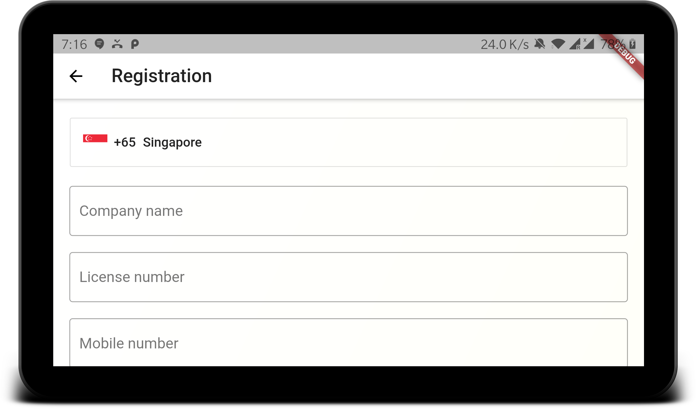

# safe_work_together

A Safe Work Together application can be used for Employees submit their health related data to their employer. 
Employer can see the Employer daily health related data using this app.

  
  
  

  
  

